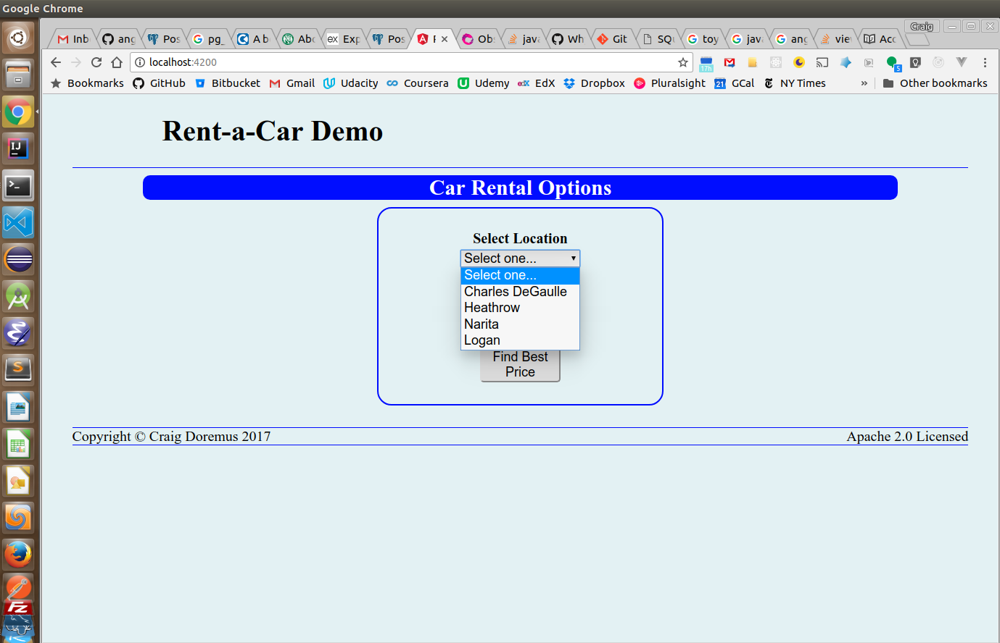
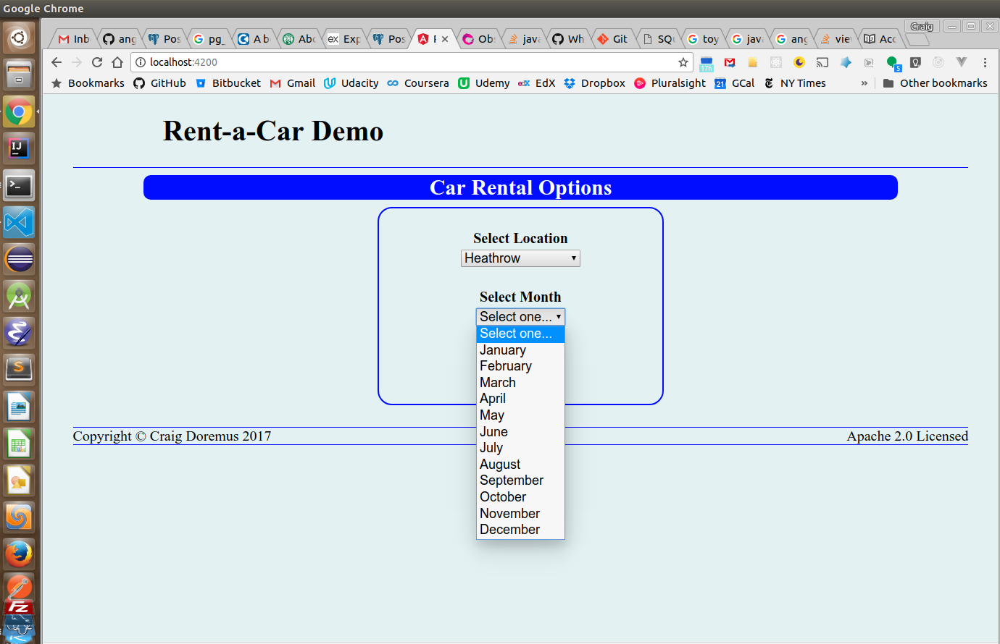
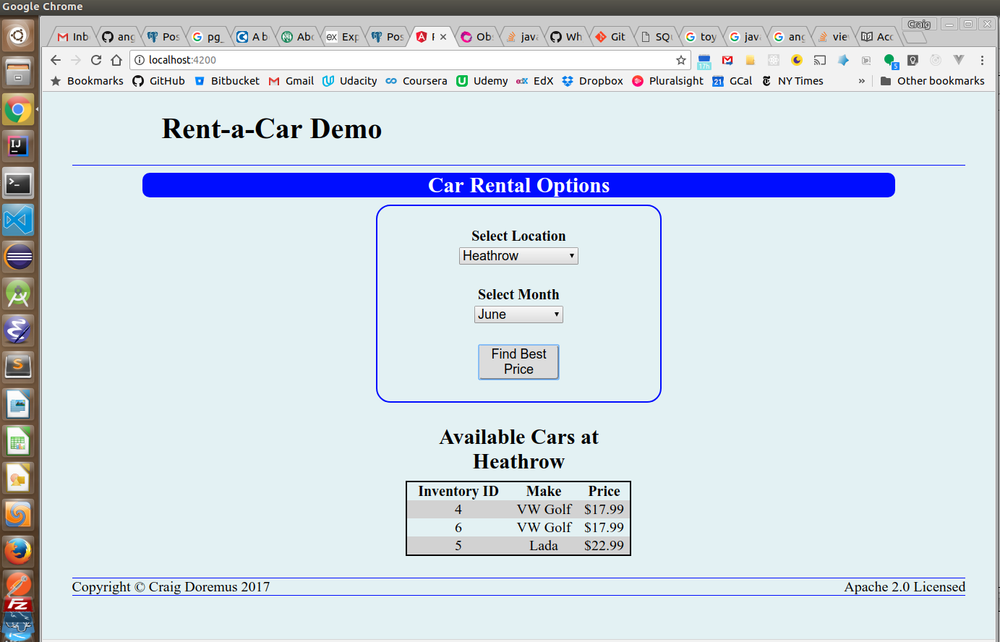

# Car Rental Demo Application

This application is designed to query a database to find the best price for a rental location by season. It uses [Angular 4](https://angular.io/) for the front end and a back end employing [Node](https://nodejs.org/en/)/[Express](https://expressjs.com/) to provide data from a [PostgreSQL](https://www.postgresql.org/) database. The communication between the front and back end is mediated by a REST API.

The requirements for this project only asked to show the car at each location with the best price for a season. Instead, I decided to show all the available cars ordered by price since most customers do not choose a rental car solely based on price.

Also, the same car make may ne displayed multiple times in the best-price query if there are multiple cars of the same make available for a particular location in the inventory. The inventory Id is shown in the best-price query results table to confirm that the query is not displaying duplicate data.

The database contains five tables:
* `location` - holds one record per location
* `car` - holds one record for each car make
* `inventory` - holds a record for every car in a location's inventory. Has a one-to-many relationship with the `location` table
* `season` - holds one record for each location's season. Also has a one-to-many relation with the `location` table.
* `price` - holds a price record for every location, car and season.

The full database schema DDL can be found in the [Readme.md file in the node-car-rental folder](./node-car-rental/Readme.md).

The amount of time available to do this project caused me to simplify a few things:
* Data was loaded into the database to allow best price querying of four locations. Further development of the application would allow data entry by an employee.
* The availability of cars in the inventory was determined by the `is_rented` field in the `inventory` table. Normally, the inventory would be linked to a transaction table which would indicate cars in the inventory rented or reserved by customers using the rental date and return date.
* Seasonal choices are shown on the front end by a drop-down to select a month. Each location had only two contiguous seasons based on months of the year. Further development of this application should require a more realistic segregation of seasons.

## Screenshots

### Location selection

### Month selection

### Best Price Query Results

## Running the project
See the `Readme.md` file in each folder for how to setup the application's front and back end.
